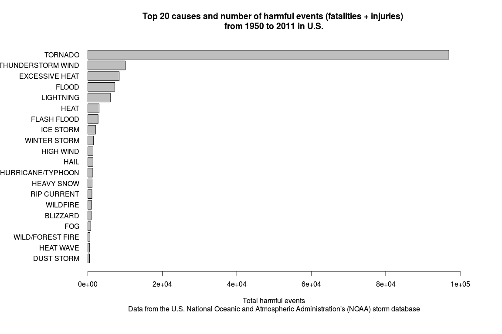

## Peer assessment 2 - Exploring the U.S. National Oceanic and Atmospheric Administration's (NOAA) storm database

### Download and preprocessing data

Load needed packages

```r
require(R.utils)
require(ggplot2)
```


Set work directory, download and extract bzipped dataset

```r
setwd("~/NOAAstorm_PeerAssesment2")
if (!file.exists("NOAAstorm.csv.bz2")) {
        url <- "https://d396qusza40orc.cloudfront.net/repdata%2Fdata%2FStormData.csv.bz2"
        download.file(url,"NOAAstorm.csv.bz2",method="curl")        
        }
if (!file.exists("NOAAstorm.csv")) {
        bunzip2("NOAAstorm.csv.bz2","NOAAstorm.csv",remove=FALSE)
        } 
db <- read.csv("NOAAstorm.csv", na.strings = "")
```

```
## Warning: EOF within quoted string
```

Create a class date factor

```r
db$date <- strptime(as.character(db$BGN_DATE),"%m/%d/%Y %H:%M:%S")
```

Download Storm Data Documentation

```r
if (!file.exists("Storm.Data.Documentation.pdf")) {
    url1 = "https://d396qusza40orc.cloudfront.net/repdata%2Fpeer2_doc%2Fpd01    016005curr.pdf"
    download.file(url1,"Storm.Data.Documentation.pdf",method="curl")
        }
```


### Across the United States, which types of events (as indicated in the EVTYPE variable) are most harmful with respect to population health?

Select variables to answer the question

```r
db1 <- db[,c("BGN_DATE","STATE","EVTYPE","FATALITIES","INJURIES")]
str (db1)
```

```
## 'data.frame':	404386 obs. of  5 variables:
##  $ BGN_DATE  : Factor w/ 12354 levels "10/10/1954 0:00:00",..: 4456 4456 2775 8169 1001 1001 1026 1922 2619 2619 ...
##  $ STATE     : Factor w/ 58 levels "AK","AL","AM",..: 2 2 2 2 2 2 2 2 2 2 ...
##  $ EVTYPE    : Factor w/ 924 levels "?","ABNORMAL WARMTH",..: 783 783 783 783 783 783 783 783 783 783 ...
##  $ FATALITIES: num  0 0 0 0 0 0 0 0 1 0 ...
##  $ INJURIES  : num  15 0 2 2 2 6 1 0 14 0 ...
```
Create a variable that sums fatalities and injuries and eliminate events without harm

```r
db1$harm <- db1$FATALITIES + db1$INJURIES
summary(db1$harm)
```

```
##    Min. 1st Qu.  Median    Mean 3rd Qu.    Max. 
##     0.0     0.0     0.0     0.3     0.0  1740.0
```

```r
db2 <- db1[db1$harm > 0,]
```

Summarize harm for each event type

```r
eventharm.df <- aggregate(harm ~ EVTYPE, data = db2, FUN = "sum")
```

Extract the top 20 causes of harm, aggregate thunderstorm and current rip data because present in different place, and make a bar graph 

```r
top <- eventharm.df[order(-eventharm.df$harm),]
top$harm1 <- top$harm
top$harm1[3] <- top$harm[3] + top$harm[9] + top$harm[16]
top$harm1[19] <- top$harm[19] + top$harm[21]
top <- top[order(top$harm1,decreasing=T),][c(-9,-17,-21),]
top[2,1] <- "THUNDERSTORM WIND" 
top20 <- top[1:20,]
top20reordered <- top20[order(top20$harm1),]
par(mai=c(1.5,2.1,1,1))
barplot(top20reordered$harm1, horiz = T, names.arg = top20reordered$EVTYPE, las = 1,xlim=c(0,100000), cex.names = 1, xlab = "Total harmful events", main = "Top 20 causes and number of harmful events (fatalities + injuries) \nfrom 1950 to 2011 in U.S.", sub = "Data from the U.S. National Oceanic and Atmospheric Administration's (NOAA) storm database")
```

 

### Across the United States, which types of events have the greatest economic consequences?

Select variables to answer the question

```r
ecocons <- db[,c("EVTYPE","PROPDMG","PROPDMGEXP","CROPDMG","CROPDMGEXP")]
str (ecocons)
```

```
## 'data.frame':	404386 obs. of  5 variables:
##  $ EVTYPE    : Factor w/ 924 levels "?","ABNORMAL WARMTH",..: 783 783 783 783 783 783 783 783 783 783 ...
##  $ PROPDMG   : num  25 2.5 25 2.5 2.5 2.5 2.5 2.5 25 25 ...
##  $ PROPDMGEXP: Factor w/ 18 levels "-","?","+","0",..: 16 16 16 16 16 16 16 16 16 16 ...
##  $ CROPDMG   : num  0 0 0 0 0 0 0 0 0 0 ...
##  $ CROPDMGEXP: Factor w/ 8 levels "?","0","2","B",..: NA NA NA NA NA NA NA NA NA NA ...
```
Create a variable that sums properties and crops damage and eliminate events without economic impact

```r
ecocons$PROPDMGEXP <- as.character(toupper(ecocons$PROPDMGEXP))
ecocons$CROPDMGEXP <- as.character(toupper(ecocons$CROPDMGEXP))
ecocons1 <- na.omit(ecocons)
for (i in 1:nrow(ecocons1)) {
        if (ecocons1$PROPDMGEXP[i] == "H") {
                ecocons1$PROPimpact[i] = ecocons1$PROPDMG[i] * 100} else if (ecocons1$PROPDMGEXP[i] == "K") {
                        ecocons1$PROPimpact[i] = ecocons1$PROPDMG[i] * 1000} else if (ecocons1$PROPDMGEXP[i] == "M") {ecocons1$PROPimpact[i] = ecocons1$PROPDMG[i] * 1000000} else if (ecocons1$PROPDMGEXP[i] == "B") {ecocons1$PROPimpact[i] = ecocons1$PROPDMG[i] * 1000000000} else {
                                        ecocons1$PROPimpact[i] = NA
        }
}
```
