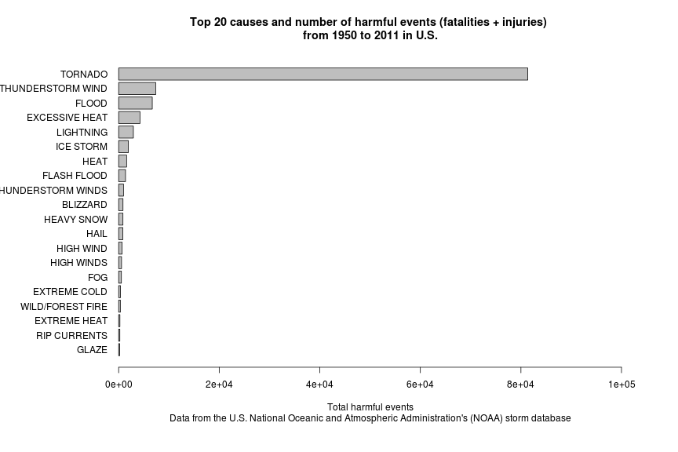

---
output:
  html_document:
    keep_md: yes
---
## Peer assessment 2 - Exploring the U.S. National Oceanic and Atmospheric Administration's (NOAA) storm database

### Download and preprocessing data

Load needed packages

```r
library(R.utils)
library(ggplot2)
```


Set work directory, download and extract bzipped dataset

```r
setwd("~/NOAAstorm_PeerAssesment2")
dir <- dir()
fileex <- dir=="NOAAstorm.csv.bz2"
fileex1 <- sum(fileex*1)
if (fileex1==0) {
        url <- "https://d396qusza40orc.cloudfront.net/repdata%2Fdata%2FStormData.csv.bz2"
        download.file(url,"NOAAstorm.csv.bz2",method="curl")        
        }
fileex2 <- dir=="NOAAstorm.csv"
fileex3 <- sum(fileex2*1)
        if (fileex3==0) {
        bunzip2("NOAAstorm.csv.bz2","NOAAstorm.csv",remove=FALSE)
        } 
db <- read.csv("NOAAstorm.csv", na.strings = "")
```

```
## Warning: EOF within quoted string
```
Download Storm Data Documentation

```r
if (!file.exists("Storm.Data.Documentation.pdf")) {
    url1 = "https://d396qusza40orc.cloudfront.net/repdata%2Fpeer2_doc%2Fpd01    016005curr.pdf"
    download.file(url1,"Storm.Data.Documentation.pdf",method="curl")
}
```


### Across the United States, which types of events (as indicated in the EVTYPE variable) are most harmful with respect to population health?

Select variables to answer the question

```r
db1 <- db[,c("BGN_DATE","STATE","EVTYPE","FATALITIES","INJURIES")]
summary (db1)
```

```
##               BGN_DATE          STATE                       EVTYPE      
##  5/31/1998 0:00:00:   933   TX     : 45028   TSTM WIND         :144163  
##  5/18/1995 0:00:00:   766   OK     : 28966   HAIL              :131021  
##  6/18/1998 0:00:00:   695   KS     : 24186   TORNADO           : 43855  
##  5/17/1999 0:00:00:   623   MO     : 15151   THUNDERSTORM WINDS: 20843  
##  6/29/1998 0:00:00:   614   NE     : 14654   FLASH FLOOD       : 14980  
##  5/15/1998 0:00:00:   592   AR     : 13978   LIGHTNING         :  6774  
##  (Other)          :400163   (Other):262423   (Other)           : 42750  
##    FATALITIES     INJURIES     
##  Min.   :  0   Min.   :   0.0  
##  1st Qu.:  0   1st Qu.:   0.0  
##  Median :  0   Median :   0.0  
##  Mean   :  0   Mean   :   0.3  
##  3rd Qu.:  0   3rd Qu.:   0.0  
##  Max.   :583   Max.   :1700.0  
## 
```

Create a variable that sum fatalities and injuries and eliminate events without harm

```r
db1$harm <- db1$FATALITIES + db1$INJURIES
summary(db1$harm)
```

```
##    Min. 1st Qu.  Median    Mean 3rd Qu.    Max. 
##     0.0     0.0     0.0     0.3     0.0  1740.0
```

```r
db2 <- db1[db1$harm > 0,]
```

Summarize harm for each event type

```r
eventharm.df <- aggregate(harm ~ EVTYPE, data = db2, FUN = "sum")
```

Extract the top 20 causes of harm, aggregate thunderstorm and current rip data, and make a pie graph 

```r
top <- eventharm.df[order(-eventharm.df$harm),]
top$harm1 <- top$harm
top$harm1[3] <- top$harm[3] + top$harm[9] + top$harm[16]
top$harm1[19] <- top$harm[19] + top$harm[21]
top <- top[order(top$harm1,decreasing=T),][c(-9,-17,-21),]
top[2,1] <- "THUNDERSTORM WIND" 
top20 <- top[1:20,]
top20reordered <- top20[order(top20$harm1),]
par(mai=c(1.5,2.1,1,1))
barplot(top20reordered$harm1, horiz = T, names.arg = top20reordered$EVTYPE, las = 1,xlim=c(0,100000), cex.names = 1, xlab = "Total harmful events", main = "Top 20 causes and number of harmful events (fatalities + injuries) \nfrom 1950 to 2011 in U.S.", sub = "Data from the U.S. National Oceanic and Atmospheric Administration's (NOAA) storm database")
```

 


```r
db$date <- strptime(as.character(db$BGN_DATE),"%m/%d/%Y %H:%M:%S")
```

