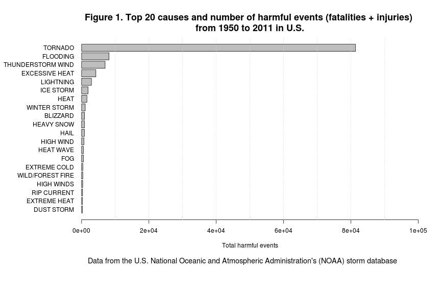
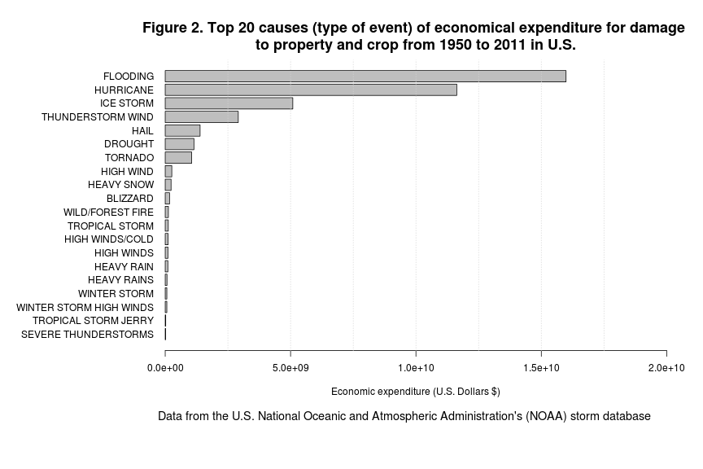
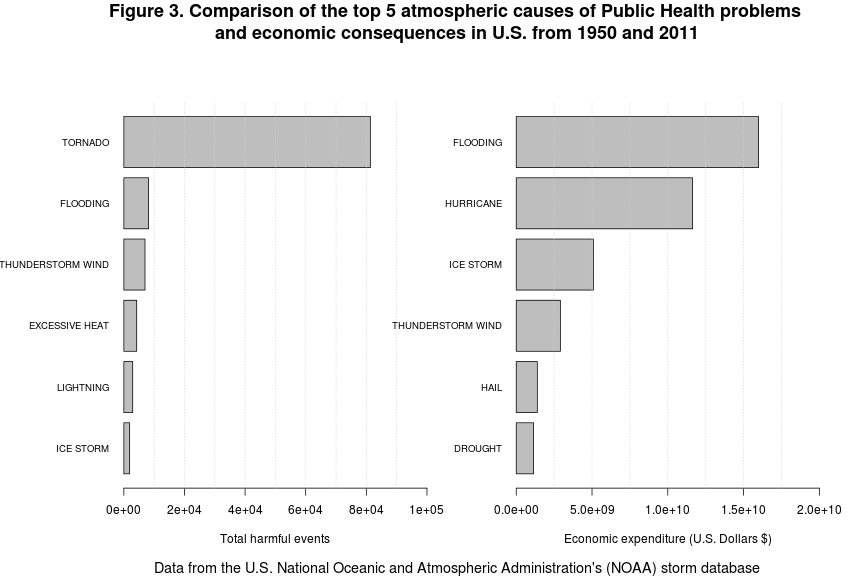

## In U.S. tornado and flooding are the leading causes of public health problems and economic consequences associated with atmospheric events from years 1950 to 2011 according to the data of the U.S. National Oceanic and Atmospheric Administration's (NOAA) storm database

### SYNOPSIS
1. The aim of our analysis was to establish the leading causes of public health problems and economic consequences associated with atmosperic events in U.S.
2. In particular, we answered to the following questions:
  * Across the United States, which types of events are most harmful with respect to population health?
  * Across the United States, which types of events have the greatest economic consequences?
3. For our aim we use the data of the U.S. National Oceanic and Atmospheric Administration's (NOAA) storm database which is freely available online   
4. This database tracks characteristics of major storms and weather events in the United States, including when and where they occur, as well as estimates of any fatalities, injuries, and property damage from years 1950 to 2011
5. To answer to the first question we summarized public health problems by aggregating the number of fatalities and injuries that were directly or indirectly associated with the type of atmospheric event. 
6. To answer to the second question we summarize economic consequences by aggregating the expenses (in U.S. dollars) due to properties and crops damage associated with the type of atmospheric event
7. The answer to the first question is represented in Figure 1, a bargraph showing the top 20 causes (atmospheric event) of public health problems (total harmful events) and tornado was the leading cause. 
8. The answer to the second question is represented in Figure 2, a bargraph showing the top 20 causes of economic consequences (economic impact) due to atmospheric event associated damages and flooding was the leading cause.
9. In figure 3 we compare the top 5 atmospheric events responsible for public health problems and economic consequences, it shows that tornado/hurricane, flooding, and thunderstorm wind were responsible for the majority of harmful events and economic expenditures. 
10. In conclusion, U.S. Government should taking in to account politics to limit the adverse effects especially of tornado/hurricane, flooding, and thunderstorm wind to have a real positive impact on Public Health and Economy of U.S. 

### DATA PROCESSING

Load needed packages

```r
require(R.utils)
```

Set work directory, download and extract bzipped dataset and store locally

```r
setwd("~/NOAAstorm_PeerAssesment2/")
if (!file.exists("NOAAstorm.csv.bz2")) {
        url <- "https://d396qusza40orc.cloudfront.net/repdata%2Fdata%2FStormData.csv.bz2"
        download.file(url,"NOAAstorm.csv.bz2", method = "curl")        
        }
if (!file.exists("NOAAstorm.csv")) {
        bunzip2("NOAAstorm.csv.bz2","NOAAstorm.csv",remove=FALSE)
        } 
db <- read.csv("NOAAstorm.csv", na.strings = "")
```

```
## Warning: EOF within quoted string
```

Create a class date factor

```r
db$date <- strptime(as.character(db$BGN_DATE),"%m/%d/%Y %H:%M:%S")
```

Download Storm Data Documentation and store locally

```r
if (!file.exists("Storm.Data.Documentation.pdf")) {
    url1 = "https://d396qusza40orc.cloudfront.net/repdata%2Fpeer2_doc%2Fpd01016005curr.pdf"
    download.file(url1,"Storm.Data.Documentation.pdf", method = "curl")
        }
```

##Results

### Question 1: Across the United States, which types of events (as indicated in the EVTYPE variable) are most harmful with respect to population health?

Select variables to answer the question

```r
db1 <- db[,c("BGN_DATE","STATE","EVTYPE","FATALITIES","INJURIES")]
str (db1)
```

```
## 'data.frame':	404386 obs. of  5 variables:
##  $ BGN_DATE  : Factor w/ 12354 levels "10/10/1954 0:00:00",..: 4456 4456 2775 8169 1001 1001 1026 1922 2619 2619 ...
##  $ STATE     : Factor w/ 58 levels "AK","AL","AM",..: 2 2 2 2 2 2 2 2 2 2 ...
##  $ EVTYPE    : Factor w/ 924 levels "?","ABNORMAL WARMTH",..: 783 783 783 783 783 783 783 783 783 783 ...
##  $ FATALITIES: num  0 0 0 0 0 0 0 0 1 0 ...
##  $ INJURIES  : num  15 0 2 2 2 6 1 0 14 0 ...
```

Create a variable that sums fatalities and injuries and eliminate events without harm

```r
db1$harm <- db1$FATALITIES + db1$INJURIES
summary(db1$harm)
```

```
##    Min. 1st Qu.  Median    Mean 3rd Qu.    Max. 
##     0.0     0.0     0.0     0.3     0.0  1740.0
```

```r
db2 <- db1[db1$harm > 0,]
```

Extract the top 20 causes of harm, aggregate similar type of events, and make a bargraph 

```r
db2$EVTYPE <- toupper(db2$EVTYPE)
db2$EVTYPE[grep("TSTM WIND", db2$EVTYPE)] <- "THUNDERSTORM WIND"
db2$EVTYPE[grep("THUNDERSTORM WIND", db2$EVTYPE)] <- "THUNDERSTORM WIND"
db2$EVTYPE[grep("FLOOD", db2$EVTYPE)] <- "FLOODING"
db2$EVTYPE[grep("FLOODING", db2$EVTYPE)] <- "FLOODING"
db2$EVTYPE[grep("HURRICANE",db2$EVTYPE)] <- "HURRICANE"
db2$EVTYPE[grep("RIP CURRENT",db2$EVTYPE)] <- "RIP CURRENT"
db3 <- aggregate(harm ~ EVTYPE, data=db2,FUN = "sum")
top <- db3[order(db3$harm,decreasing=T),]
top20 <- top[1:20,]
top20reordered <- top20[order(top20$harm),]
par(mfrow = c(1,1), oma = c(5,7,1,1), cex.main = 1.5)
barplot(top20reordered$harm, horiz = T, names.arg = top20reordered$EVTYPE, las = 1, cex.names = 1, xlab = "Total harmful events", xlim = c(0,100000), main = "Figure 1. Top 20 causes and number of harmful events (fatalities + injuries) \nfrom 1950 to 2011 in U.S.")
mtext("Data from the U.S. National Oceanic and Atmospheric Administration's (NOAA) storm database", side = 1, outer = T, cex = 1.2) 
grid(10, NA)
```

 

### Question 2: Across the United States, which types of events have the greatest economic consequences?

Select variables to answer the question

```r
ecocons <- db[,c("EVTYPE","PROPDMG","PROPDMGEXP","CROPDMG","CROPDMGEXP")]
str (ecocons)
```

```
## 'data.frame':	404386 obs. of  5 variables:
##  $ EVTYPE    : Factor w/ 924 levels "?","ABNORMAL WARMTH",..: 783 783 783 783 783 783 783 783 783 783 ...
##  $ PROPDMG   : num  25 2.5 25 2.5 2.5 2.5 2.5 2.5 25 25 ...
##  $ PROPDMGEXP: Factor w/ 18 levels "-","?","+","0",..: 16 16 16 16 16 16 16 16 16 16 ...
##  $ CROPDMG   : num  0 0 0 0 0 0 0 0 0 0 ...
##  $ CROPDMGEXP: Factor w/ 8 levels "?","0","2","B",..: NA NA NA NA NA NA NA NA NA NA ...
```

Create a variable that sums properties and crops damage, eliminate events without economic impact, and aggregate similar type of event

```r
ecocons$PROPDMGEXP <- as.character(toupper(ecocons$PROPDMGEXP))
ecocons$CROPDMGEXP <- as.character(toupper(ecocons$CROPDMGEXP))
ecoconsNA <- na.omit(ecocons)
ecocons1 <- ecoconsNA["PROPDMG" > 0 | "CROPDMG" > 0,]
for (i in 1:nrow(ecocons1)) {
    if (ecocons1$PROPDMGEXP[i] == "H") {
            ecocons1$PROPimpact[i] = ecocons1$PROPDMG[i] * 100
                } else if (ecocons1$PROPDMGEXP[i] == "K") {
                        ecocons1$PROPimpact[i] = ecocons1$PROPDMG[i] * 1000
                        } else if (ecocons1$PROPDMGEXP[i] == "M") {
                            ecocons1$PROPimpact[i] = ecocons1$PROPDMG[i] * 1000000
                            } else if (ecocons1$PROPDMGEXP[i] == "B") {ecocons1$PROPimpact[i] = ecocons1$PROPDMG[i] * 1000000000                                                                       } else {
                                ecocons1$PROPimpact[i] = NA
                                }
}

for (n in 1:nrow(ecocons1)) {
        if (ecocons1$CROPDMGEXP[n] == "K") {
            ecocons1$CROPimpact[n] = ecocons1$CROPDMG[n] * 1000
            } else if (ecocons1$CROPDMGEXP[n] == "M") {
                ecocons1$CROPimpact[n] = ecocons1$CROPDMG[n] * 1000000
                } else if (ecocons1$CROPDMGEXP[n] == "B") {
                    ecocons1$CROPimpact[n] = ecocons1$CROPDMG[n] * 1000000000
                    } else {
                        ecocons1$CROPimpact[n] = NA
                        }
}

ecocons1$totimpact <- with(ecocons1,(PROPimpact + CROPimpact)) 
ecocons1$EVTYPE <- toupper(ecocons1$EVTYPE)
ecocons1$EVTYPE[grep("TSTM WIND", ecocons1$EVTYPE)] <- "THUNDERSTORM WIND"
ecocons1$EVTYPE[grep("THUNDERSTORM WIND", ecocons1$EVTYPE)] <- "THUNDERSTORM WIND"
ecocons1$EVTYPE[grep("FLOOD", ecocons1$EVTYPE)] <- "FLOODING"
ecocons1$EVTYPE[grep("FLOODING", ecocons1$EVTYPE)] <- "FLOODING"
ecocons1$EVTYPE[grep("HURRICANE",ecocons1$EVTYPE)] <- "HURRICANE"
ecocons2 <- aggregate(totimpact ~ EVTYPE, data=ecocons1,FUN = "sum")
topimpact <- ecocons2[order(ecocons2$totimpact,decreasing=T),]
```

Create a bargraph with the top 20 type of event with economic impact in U.S. from 1950 to 2011

```r
topimpact20 <- topimpact[1:20,]
topimp20reord <- topimpact20[order(topimpact20$totimpact),]
par(mfrow = c(1,1), oma = c(5,10,1,1), cex.main = 1.5)
barplot(topimp20reord$totimpact, horiz = T, names.arg = topimp20reord$EVTYPE, las = 1, cex.names = 1, xlab = "Economic expenditure (U.S. Dollars $)", xlim = c(0,20000000000), main = "Figure 2. Top 20 causes (type of event) of economical expenditure for damage \nto property and crop from 1950 to 2011 in U.S.") 
mtext("Data from the U.S. National Oceanic and Atmospheric Administration's (NOAA) storm database", side = 1, outer = T, cex = 1.2) 
grid(8, NA)
```

 
Comparison of top 5 type of event of harm and economic impact in U.S. from 1950 and 2011

```r
par(mfrow=c(1,2),oma = c(1,4.5,3,1))
barplot(top20reordered$harm[15:20], horiz = T, names.arg = top20reordered$EVTYPE[15:20], las = 1, cex.names = 0.8, xlim = c(0,100000), xlab = "Total harmful events")
grid(10,NA)
barplot(topimp20reord$totimpact[15:20], horiz = T, names.arg = topimp20reord$EVTYPE[15:20], las = 1, cex.names = 0.8, xlim = c(0,20000000000), xlab = "Economic expenditure (U.S. Dollars $)")
grid(8,NA)
title("Figure 3. Comparison of the top 5 atmospheric causes of Public Health problems \nand economic consequences in U.S. from 1950 and 2011", outer = T, cex.main = 1.5) 
mtext("Data from the U.S. National Oceanic and Atmospheric Administration's (NOAA) storm database", side = 1, outer = T, cex = 1.2 )
```

 
