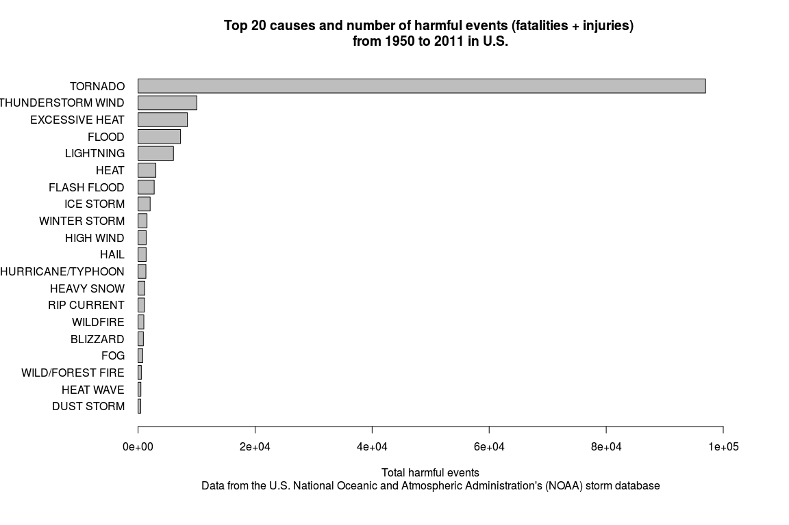

## In U.S. tornado and flooding are the leading causes of harmful events and economic impact, respectively, from years 1950 to 2011 according to the data of the U.S. National Oceanic and Atmospheric Administration's (NOAA) storm database

### SYNOPSIS
* The aim of our analysis was to establish the leading causes of harmful events and economic impact due to atmosperic events in U.S.
* In particular, we responded to the following questions:
1. Across the United States, which types of events (as indicated in the EVTYPE variable) are most harmful with respect to population health?
2. Across the United States, which types of events have the greatest economic consequences?
* For our aim we use the data of the U.S. National Oceanic and Atmospheric Administration's (NOAA) storm database that are freely available at the following link https://d396qusza40orc.cloudfront.net/repdata%2Fdata%2FStormData.csv.bz2  
* This database tracks characteristics of major storms and weather events in the United States, including when and where they occur, as well as estimates of any fatalities, injuries, and property damage from years 1950 to 2011
* Database was bunzipped from the original website location and stored locally.
* To respond to the first question we summarized harmful events aggregating fatalities and injuries that were directly or indirectly associated with the type of atmospheric event. 
* To respond to the second question we aggregate the economic impact of the damage to properties and crops (in U.S. dollars) that was associated with the type of athmosferic events.
* The answer to the first question is represented in Figure 1, a bargraph showing the top 20 causes (atmospheric event) of public health problems (harmful events). Tornado was the leading causes. 
*The answer to the second question is represented in Figure 2, a bargraph showing the top 20 causes of economic impact due to the atmospheric event. Flooding was the leading cause.
*In figure 3 we compare the top 5 atmospheric events responsible of public health problems and economic impact, respectively. Tornado/hurricane, flooding, and thunderstorm wind were responsible for the majority of harmful events and economic impact. 
* In conclusion, U.S. Government should taking in to account politics to limit the adverse effects especially of tornado/hurricane, flooding, and thunderstorm wind to have a real positive impact on public health and economy of U.S. 

### DATA PROCESSING

Load needed packages

```r
require(R.utils)
```

```
## Loading required package: R.utils
## Loading required package: R.oo
## Loading required package: R.methodsS3
## R.methodsS3 v1.6.1 (2014-01-04) successfully loaded. See ?R.methodsS3 for help.
## R.oo v1.18.0 (2014-02-22) successfully loaded. See ?R.oo for help.
## 
## Attaching package: 'R.oo'
## 
## The following objects are masked from 'package:methods':
## 
##     getClasses, getMethods
## 
## The following objects are masked from 'package:base':
## 
##     attach, detach, gc, load, save
## 
## R.utils v1.32.4 (2014-05-14) successfully loaded. See ?R.utils for help.
## 
## Attaching package: 'R.utils'
## 
## The following object is masked from 'package:utils':
## 
##     timestamp
## 
## The following objects are masked from 'package:base':
## 
##     cat, commandArgs, getOption, inherits, isOpen, parse, warnings
```

```r
require(ggplot2)
```

```
## Loading required package: ggplot2
```

```
## Warning: there is no package called 'ggplot2'
```

```r
require(RCurl)
```

```
## Loading required package: RCurl
## Loading required package: bitops
## 
## Attaching package: 'RCurl'
## 
## The following object is masked from 'package:R.utils':
## 
##     reset
## 
## The following object is masked from 'package:R.oo':
## 
##     clone
```

Set work directory, download and extract bzipped dataset

```r
setwd("D:/Documents/GitHub/NOAAstorm_PeerAssesment2/")
if (!file.exists("NOAAstorm.csv.bz2")) {
        url <- "http://d396qusza40orc.cloudfront.net/repdata%2Fdata%2FStormData.csv.bz2"
        download.file(url,"NOAAstorm.csv.bz2")        
        }
if (!file.exists("NOAAstorm.csv")) {
        bunzip2("NOAAstorm.csv.bz2","NOAAstorm.csv",remove=FALSE)
        } 
db <- read.csv("NOAAstorm.csv", na.strings = "")
```

Create a class date factor

```r
db$date <- strptime(as.character(db$BGN_DATE),"%m/%d/%Y %H:%M:%S")
```

Download Storm Data Documentation

```r
if (!file.exists("Storm.Data.Documentation.pdf")) {
    url1 = "http://d396qusza40orc.cloudfront.net/repdata%2Fpeer2_doc%2Fpd01    016005curr.pdf"
    download.file(url1,"Storm.Data.Documentation.pdf")
        }
```

##Results

# Across the United States, which types of events (as indicated in the EVTYPE variable) are most harmful with respect to population health?

Select variables to answer the question

```r
db1 <- db[,c("BGN_DATE","STATE","EVTYPE","FATALITIES","INJURIES")]
str (db1)
```

```
## 'data.frame':	902297 obs. of  5 variables:
##  $ BGN_DATE  : Factor w/ 16335 levels "1/1/1966 0:00:00",..: 6523 6523 4242 11116 2224 2224 2260 383 3980 3980 ...
##  $ STATE     : Factor w/ 72 levels "AK","AL","AM",..: 2 2 2 2 2 2 2 2 2 2 ...
##  $ EVTYPE    : Factor w/ 985 levels "   HIGH SURF ADVISORY",..: 834 834 834 834 834 834 834 834 834 834 ...
##  $ FATALITIES: num  0 0 0 0 0 0 0 0 1 0 ...
##  $ INJURIES  : num  15 0 2 2 2 6 1 0 14 0 ...
```
Create a variable that sums fatalities and injuries and eliminate events without harm

```r
db1$harm <- db1$FATALITIES + db1$INJURIES
summary(db1$harm)
```

```
##    Min. 1st Qu.  Median    Mean 3rd Qu.    Max. 
##     0.0     0.0     0.0     0.2     0.0  1740.0
```

```r
db2 <- db1[db1$harm > 0,]
```

Extract the top 20 causes of harm, aggregate similar type of events, and make a bar graph 

```r
db2$EVTYPE <- toupper(db2$EVTYPE)
db2$EVTYPE[grep("TSTM WIND", db2$EVTYPE)] <- "THUNDERSTORM WIND"
db2$EVTYPE[grep("THUNDERSTORM WIND", db2$EVTYPE)] <- "THUNDERSTORM WIND"
db2$EVTYPE[grep("FLASH FLOOD", db2$EVTYPE)] <- "FLOOD"
db2$EVTYPE[grep("RIVER FLOOD", db2$EVTYPE)] <- "FLOOD"
db2$EVTYPE[grep("HURRICANE",db2$EVTYPE)] <- "HURRICANE"
db2$EVTYPE[grep("RIP CURRENT",db2$EVTYPE)] <- "RIP CURRENT"
db3 <- aggregate(harm ~ EVTYPE, data=db2,FUN = "sum")
top <- db3[order(db3$harm,decreasing=T),]
top20 <- top[1:20,]
top20reordered <- top20[order(top20$harm),]
par(mfrow = c(1,1), mai=c(1.5,2.1,1,1))
barplot(top20reordered$harm, horiz = T, names.arg = top20reordered$EVTYPE, las = 1,xlim=c(0,100000), cex.names = 1, xlab = "Total harmful events", main = "Top 20 causes and number of harmful events (fatalities + injuries) \nfrom 1950 to 2011 in U.S.", sub = "Data from the U.S. National Oceanic and Atmospheric Administration's (NOAA) storm database")
```

 

# Across the United States, which types of events have the greatest economic consequences?

Select variables to answer the question

```r
ecocons <- db[,c("EVTYPE","PROPDMG","PROPDMGEXP","CROPDMG","CROPDMGEXP")]
str (ecocons)
```

```
## 'data.frame':	902297 obs. of  5 variables:
##  $ EVTYPE    : Factor w/ 985 levels "   HIGH SURF ADVISORY",..: 834 834 834 834 834 834 834 834 834 834 ...
##  $ PROPDMG   : num  25 2.5 25 2.5 2.5 2.5 2.5 2.5 25 25 ...
##  $ PROPDMGEXP: Factor w/ 18 levels "-","?","+","0",..: 16 16 16 16 16 16 16 16 16 16 ...
##  $ CROPDMG   : num  0 0 0 0 0 0 0 0 0 0 ...
##  $ CROPDMGEXP: Factor w/ 8 levels "?","0","2","B",..: NA NA NA NA NA NA NA NA NA NA ...
```

Create a variable that sums properties and crops damage, eliminate events without economic impact, and aggregate similar type of event

```r
ecocons$PROPDMGEXP <- as.character(toupper(ecocons$PROPDMGEXP))
ecocons$CROPDMGEXP <- as.character(toupper(ecocons$CROPDMGEXP))
ecoconsNA <- na.omit(ecocons)
ecocons1 <- ecoconsNA["PROPDMG" > 0 | "CROPDMG" > 0,]
for (i in 1:nrow(ecocons1)) {
    if (ecocons1$PROPDMGEXP[i] == "H") {
            ecocons1$PROPimpact[i] = ecocons1$PROPDMG[i] * 100
                } else if (ecocons1$PROPDMGEXP[i] == "K") {
                        ecocons1$PROPimpact[i] = ecocons1$PROPDMG[i] * 1000
                        } else if (ecocons1$PROPDMGEXP[i] == "M") {
                            ecocons1$PROPimpact[i] = ecocons1$PROPDMG[i] * 1000000
                            } else if (ecocons1$PROPDMGEXP[i] == "B") {ecocons1$PROPimpact[i] = ecocons1$PROPDMG[i] * 1000000000                                                                       } else {
                                ecocons1$PROPimpact[i] = NA
                                }
}

for (n in 1:nrow(ecocons1)) {
        if (ecocons1$CROPDMGEXP[n] == "K") {
            ecocons1$CROPimpact[n] = ecocons1$CROPDMG[n] * 1000
            } else if (ecocons1$CROPDMGEXP[n] == "M") {
                ecocons1$CROPimpact[n] = ecocons1$CROPDMG[n] * 1000000
                } else if (ecocons1$CROPDMGEXP[n] == "B") {
                    ecocons1$CROPimpact[n] = ecocons1$CROPDMG[n] * 1000000000
                    } else {
                        ecocons1$CROPimpact[n] = NA
                        }
}

ecocons1$totimpact <- with(ecocons1,(PROPimpact + CROPimpact)) 
ecocons1$EVTYPE <- toupper(ecocons1$EVTYPE)
ecocons1$EVTYPE[grep("TSTM WIND", ecocons1$EVTYPE)] <- "THUNDERSTORM WIND"
ecocons1$EVTYPE[grep("THUNDERSTORM WIND", ecocons1$EVTYPE)] <- "THUNDERSTORM WIND"
ecocons1$EVTYPE[grep("FLASH FLOOD", ecocons1$EVTYPE)] <- "FLOOD"
ecocons1$EVTYPE[grep("RIVER FLOOD", ecocons1$EVTYPE)] <- "FLOOD"
ecocons1$EVTYPE[grep("HURRICANE",ecocons1$EVTYPE)] <- "HURRICANE"
ecocons2 <- aggregate(totimpact ~ EVTYPE, data=ecocons1,FUN = "sum")
topimpact <- ecocons2[order(ecocons2$totimpact,decreasing=T),]
```

Create a horizontal bar graph with the top 20 type of event with economic impact in U.S. from 1950 to 2011

```r
topimpact20 <- topimpact[1:20,]
topimp20reord <- topimpact20[order(topimpact20$totimpact),]
par(mfrow = c(1,1), mai=c(1.5,2.1,1,1))
barplot(topimp20reord$totimpact, horiz = T, names.arg = topimp20reord$EVTYPE, las = 1,xlim=c(0,200000000000), cex.names = 1, xlab = "Economic impact ($)", main = "Top 20 causes (type of event) of economical impact for damage to property and crop \nfrom 1950 to 2011 in U.S.", sub = "Data from the U.S. National Oceanic and Atmospheric Administration's (NOAA) storm database")
```

 
Comparison of top 5 type of event of harm and economic impact in U.S. from 1950 and 2011

```r
par(mfrow=c(1,2),oma = c(3,0,3,0))
barplot(top20reordered$harm[15:20], horiz = T, names.arg = top20reordered$EVTYPE[15:20], las = 1,xlim=c(0,100000), cex.names = 1, xlab = "Total harmful events")
barplot(topimp20reord$totimpact[15:20], horiz = T, names.arg = topimp20reord$EVTYPE[15:20], las = 1,xlim=c(0,200000000000), cex.names = 1, xlab = "Economic impact ($ USD)")
mtext("Comparison of top 5 type of event of harm and economic impact \nin U.S. from 1950 and 2011",outer = T, cex = 1.5) 
mtext("Data from the U.S. National Oceanic and Atmospheric Administration's (NOAA) storm database", side = 1, outer = T )
```

 
